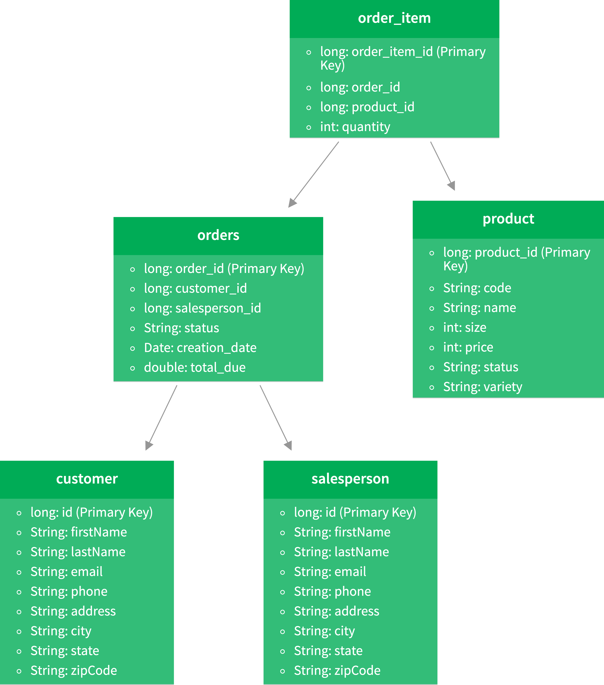

# Introduction
This application utilizes the DAO design pattern for accessing a retailer database that has tables for customer, 
orders, salespersons, and products. The program can connect to the PostgreSQL database via a driver, and perform CRUD operations against 
the database.

During the implementation of this application, I learned the basic workflow and its associated implementation of a JDBC program.
I was also introduced to some important concepts with commercial databases, and the DAO and Repository design pattern.

# ER Diagram

# Design Patterns
In this application, I used the DAO design pattern, and specifically, I implemented 2 DAO object classes to model and process
information of customer and order in the database respectively. The DAO pattern allows us to model domain objects in this 
case so that they are easy to interpret.

On the contrary, the Repository pattern focuses only on single table access per class. In this implementation of the `CustomerDAO`, since
we are accessing only the `customer` table, so it is actually a realization of Repository pattern other than DAO.

In the scenario of this application, we assume that we are only dealing with the database of one local retailer. However, in the retail
scenario, we often desire a distributed database where horizontal scaling is needed, therefore a Repository pattern may work better as it
prevents performing complex joins across databases by doing them in the code.