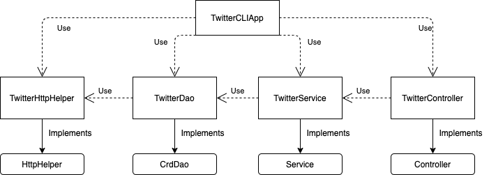

# Introduction
The Twitter CLI App is a Java application that allows users to post, view, and delete tweets
with a Command Line Interface. It is built by upon an MVC design pattern, and it accomplishes tasks
by interacting with the Twitter API. 

#### Technologies Used and Learned
- *Application Development*: MVC design pattern, Data Access Object design pattern, REST API, HTTP requests, serialization and deserialization with JSON, Spring and Spring Boot
- *Testing*: JUnit 4, Mockito
- *Application Packaging*: Maven, Docker


# Quick Start

Before running Twitter CLI App, the user should have a Twitter Developer Account and obtain API Key and API Secret Key.
The user should also create a new Application in Twitter Developer Portal to obtain an Access Token and Access Token Secret.

This application takes 2 to 3 command line arguments as inputs depending on the operation.

Arguments | Description
------------ | -------------
`post tweetText long:lat` | Post a tweet to the user's personal Twitter account with content `tweetText` and location information `long:lat`, and print the posted tweet in JSON format.
`show tweetId` | Read a tweet given `tweetId` in JSON format to standard output.
`delete tweetId1,tweetId2,...` | Delete all tweets specified by `tweetIds` and print those that are successfully deleted in JSON format to standard output.

### Running Twitter CLI App with IDE:
- Step 1: Configure environmental variables with IDE (`consumerKey` as API Key, `consumerSecret` as API Key Secret, `accessToken` as Access Token, and `tokenSecret` as Access Token Secret)
- Step 2: Configure input arguments `post|show|delete [option1] [option2]`
- Step 3: Run the `main` method in class `TwitterCLIApp` and examine output

### Running with Maven Package and Terminal
- Step 1: Go to the `core_java/twitter` directory and type in `maven clean compile package` to create the `.jar` file
- Step 2: Run the jar file with `java` command as `java -cp target/twitter-1.0-SNAPSHOT.jar ca.jrvs.apps.twitter.TwitterCLIApp post|show|delete [option1] [option2]`


# Design

### UML diagram


### Components
The responsibilities of the components specified in above UML diagram is in the below table.

Component | Description
------------ | -------------
`TwitterCLIApp` | Initializes all dependencies and passes command line arguments for `TwitterController` to process.
`TwitterController` | Reads and validates all inputs, and call the `TwitterService` object to check business logic.
`TwitterService` | Analyzes all inputs to make sure that they are compliant with the context logic (e.g. character counts, longitude and latitude range, etc.)
`TwitterDao` | The Data Access Objects layer. It serializes, and deserializes JSON and model class objects, and constructs URI for sending HTTP requests.
 `TwitterHttpHelper` | Sets up consumer and perform OAuth authentication, executes and processes HTTP request.


# Models

There are 5 POJO classes that provides models for the Data Access Object layer.

Class | Description
------------ | -------------
`Tweet` | Represents a complete tweet, and it embeds all below components.
`Entities` | Represents entities for a given tweet, which include Coordinates, list of `Hashtag`s and `UserMentions`.
`Coordinates` | Represents the tweet location as a list of longitude and latitude coordinates.
`Hashtag` | Represents a hashtag (#) in a given tweet.
`UserMention` | Represents a user mention (@) in a given tweet.


# Spring
Besides the `main` method in class `TwitterCLIApp`, this package also include 3 implementations using the Spring framework for dependency management.

- First implementation: a class `TwitterCLIBean` that uses `@Beans` to perform dependency injection.
- Second implementation: a class `TwitterCLIComponentScan` that uses `@Component` and `@Autowired` to automatically scan and inject all dependencies.
- Third implementation: a class `TwitterCLISpringBoot` that uses Spring Boot native features to perform dependency injection.


# Docker
This application can be Dockerize using the below script.

```$xslt
cd core_java/twitter
#Register Docker hub account
docker_user=your_docker_id
docker login -u ${docker_user} --password-stdin 

#Create dockerfile
cat > Dockerfile << EOF
FROM openjdk:8-alpine
COPY target/twitter*.jar /usr/local/app/twitter/lib/twitter.jar
ENTRYPOINT ["java","-jar","/usr/local/app/twitter/lib/twitter.jar"]
EOF

#Pakcage the app
mvn clean package
#build a new docker image locally
docker build -t ${docker_user}/twitter .
#verify image
docker image ls | grep "twitter"
#run docker container
docker run --rm \
-v `pwd`/data:/data -v `pwd`/log:/log \
${docker_user}/twitter post "testing tweet" 1:-1

#push the image to Docker Hubg
docker push ${docker_user}/twitter
```


# Improvements
- Further processes and filters the output of all 3 operations. Instead of printing out the whole JSON, only print selected important information.
- Improve the `post` operation so that when a duplicate tweet is passed in, instead of throwing a `RuntimeException`, tell the user that a duplicate tweet is found.
- Add another argument option for `show` operation to take screen name of a user and display his/her most recent tweets.