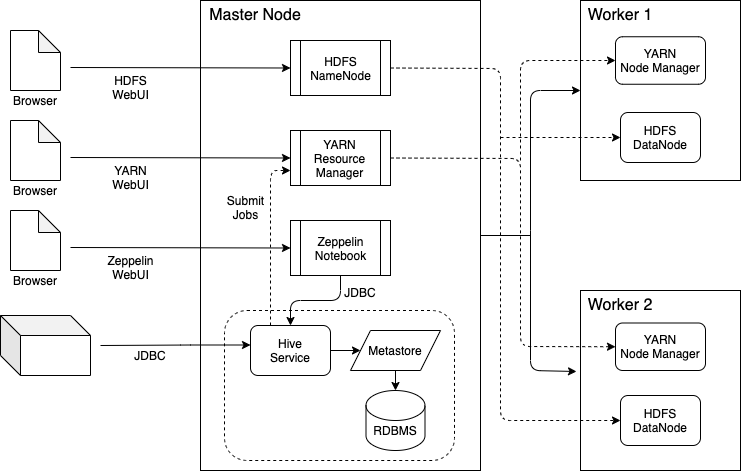

Table of contents
* [Introduction](#Introduction)
* [Hadoop Cluster](#Hadoop Cluster)
* [Hive Project](#Hive Project)
* [Improvements](#Improvements)

# Introduction

As the size of the data increases as the trading REST API application scales up, the Jarvis trading team is looking for an alternative solution for performing data analytics on big data platforms instead of SAP and R. Before migrating the data and the infrastructure, the team wants to first evaluate core Apache Hadoop components and evaluate tools used in the Hadoop ecosystem in a cloud platform. As a junior engineer, I was responsible in setting up a Hadoop cluster in GCP to experiment different tools, and then create a Zeppelin notebook to illustrate the uses of core Hadoop and Hive technologies and performance analysis for the team to review.

#### Technologies Learned and Evaluated:

- *Google Cloud Platform*: Dataproc Clusters, Compute Engines (Virtual Machines), Google Cloud Storage
- *Apache Hadoop*: Hadoop Command Line Tools, Hadoop Architecture and Cluster Set-up, HDFS, MapReduce, YARN
- *Apache Hive*: Execution Engines (Tez & Spark SQL), Dynamic Partitioning, Columar File Format, Beeline, Zeppelin Notebook

#### Apache Hadoop:

Apache Hadoop an open-source software ecosystem (platform & community) that facilitates simple and easy-to-manage distributed storage and processing of large data sets across clusters of computers. It has 3 main components, HDFS, MapReduce, and YARN.

- *HDFS*: the Hadoop system to distribute the storage of big data across a cluster of computers and provide high-throughput access following a master/slave architecture, and it guarantees fault tolerance and high availability.
- *MapReduce*: a programming model that handles the distributed processing of the data across the entire cluster. It consists of mappers which transform data in parallel within cluster efficiently, and reducers which aggregate those data to produce output.
- *YARN*: a system that manages the resources on the computing cluster, and handles the distributed processing on top of storage. It coordinates MapReduce jobs across the cluster and communicate with HDFS nodes.

# Hadoop Cluster

#### Cluster Set-up   

The Hadoop Cluster was set up using Dataproc from Google Cloud Platform, and it contains 1 master node and 2 worker nodes. The master node and worker nodes are all configured to have 2 CPUs and a 12GB RAM with 100GB disk size. The HDFS replication factor is set to 2, and YARN is configured to have 4 cores and 12GB RAM.

#### Architecture Diagram

#### Components Introduction

- *HDFS NameNode*: the master node that manages the filesystem namespace, in particular, the filesystem tree (namespace image) and metadata of all files and directories in the tree (edit log.) The namespace image and edit log are usually stored on the local disk. An HDFS cannot function without a NameNode.
- *HDFS DataNode*: the worker node that store and retrieve blocks when they are instructed to, and report back to the NameNode periodically with lists of blocks that they are storing.
- *YARN Resource Manager*: the master instance of YARN JVM that receives job submissions from the client and node status from Node Manager, and it also handles resource requests from YARN Application Master.
- *YARN Node Manager*: the worker instance of YARN JVM that runs on cluster worker machines that monitor containers compute resources, and send node status back to the Resource Manager.
- *Hive*: a data warehouse software project built on top of Apache Hadoop for providing data query and analysis developed by Facebook. In particular, Hive convert HiveQL to MapReduce (or other YARN applications such as Tez and Spark) jobs which process data on HDFS using a SQL-like interface.
- *Metastore*: the central repository of Hive metadata, and is divided into two pieces, a component in the service layer and the actual user-specified RDBMS metadata storage.
- *Hive Service*: the service manager that receives HiveQL code from users and submit jobs to the YARN resource manager, and also manage metadata.
- *Zeppelin Notebook*: provides an easy and straight-forward way to execute arbitrary code in a web-based notebook server that supports a range of YARN applications.
- *Beeline*: a Command Line Hive JDBC wrapper utility that allows users to execute Hive jobs in a HDFS, and it is one of the popular Hive clients.

# Hive Project

#### Project Structure

This project was implemented using Zeppelin Notebook, and the notebook is stored as a JSON file under `/hive` directory. The project is divided into 3 parts as below.

- *Part I*: setting up a table that loads data from a BigQuery data file in Google Cloud Storage, and compare the performance of Hive and a bash script that performs the same task.
- *Part II*: debugging the table format, and re-define and reload the data file using a non-default SerDe to achieve the desired formatting of the table.
- *Part III*: experiment with common optimization techniques with Hive (in particular, partitioning and columnar file storage), as well as the Tez and Spark SQL execution engines using some sample HiveQL queries with performance analysis.

#### Zeppelin Notebook Screenshot

# Improvements

- Combine the optimization of partitioning and columnar file format to facilitate even faster query executions
- Further discuss use cases of optimization techniques and other Hive functionalities such as map side join, user-defined functions, etc.
- Experiment with HDFS to compare performance in different settings of various number of worker nodes, data block size, etc.