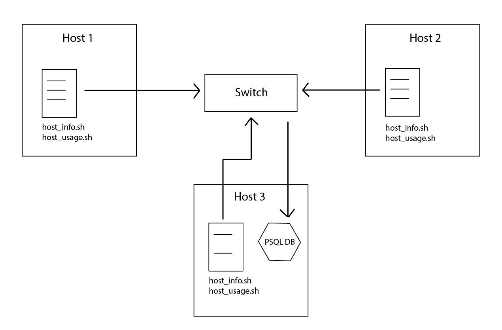

# Introduction

####Linux Cluster Monitoring Agent

This project is designed to run in Linux OS to record hardware specifications and monitor hardware usages in a cluster network of Linux servers.
The cluster monitoring agent will automate the process of setting up Docker and PostgreSQL database, then extract hardware information on every host server, and 
record the server's usages every minute. These data are then parsed into the same database for analytics using SQL queries.

#### Technologies Used

- Linux Bash, Docker, crontab
- PostgreSQL

#### Design Diagram




# Quick Start
STEP 1: Start a psql instance using `psql_docker.sh`
```
bash ./scripts/psql_docker.sh create [db_username] [db_password]
```
STEP 2: Create a psql database `host_agent` using the username and password set in STEP 1
```
# connect to the psql instance
psql -h localhost -U [db_username] -W

# create the database host_agent
postgres=# CREATE DATABASE host_agent;
```
STEP 3: Create tables using ```ddl.sql```
```
psql -h localhost -U [db_username] -d host_agent -f ./sql/ddl.sql
```
STEP 4: Insert hardware specifications data into ```host_agent``` using host_info.sh
```
bash ./scripts/host_info.sh localhost 5432 host_agent [db_username] [db_password]
```
STEP 5: Crontab setup to run `host_usage.sh` automatically at every minute
```
# First type in the below command to open a crontab editor
crontab -e

# Input the below text. Note that the log file is for verifying whether the scripts work properly
* * * * * bash /path_to_directory/scripts/host_usage.sh localhost 5432 host_agent [db_username] [db_password] > /tmp/host_usage.log
```

# Database Modeling
The schema of each table is described as below:
- `host_info`

Column Name | Description
------------ | -------------
`id` | Unique ID for a cluster member host, implemented as an auto-increment primary key
`hostname` | Unique name string for a cluster member host
`cpu_number` | Integer number of the number of CPU cores
`cpu_arch` | String representing the architecture of the CPU
`cpu_model` | String representing the model name of the CPU
`cpu_mhz` | Integer number of the speed (in MHz) of the CPU
`l2_cache` | Integer number of the volume of L2 cache of the CPU (in KB)
`total_mem` | Integer number of the host's total memory (in KB)
`record_time` | Timestamp for this record in format YYYY-MM-DD XX:XX:XX

- `host_usage`

Column Name | Description
------------ | -------------
`host_id` | Unique ID for a cluster member host, implemented as a foreign key to `host_info.id`
`memory_free` | Integer number of memory currently not in use (in MB)
`cpu_idle` | Integer percentage of time the CPU is idle
`cpu_kernel` | Integer percentage of time the CPU runs kernel
`disk_io` | Integer number of operations running on the disk
`disk_available` | Integer number of disk's free storage (in MB)
`record_time` | Timestamp for this record in format YYYY-MM-DD XX:XX:XX

## Scripts
In this project, there are 3 `.sh` scripts file and 2 `.sql` files.
- `psql_docker.sh`: 

The file to start and configure docker image and container for this project, and it also creates a PSQL instance.
It takes 3 arguments (`action`, `db_username`, `db_password`), and note that the latter 2 arguments are only needed when `action` is either `stop` or `start`.

- `host_info.sh`:

The file to extract hardware specification data (as described in `host_info`), and construct SQL statements to insert the data into table `host_info`.
It takes 5 arguments (`psql_host`, `psql_port`, `db_name`, `db_username`, `db_password`), and it is run one time in each host in the cluster.

- `host_usage.sh`:

The file to extract hardware usage data (as described in `host_usage`), and construct SQL statements to insert the data into table `host_usage`.
It takes 5 arguments (`psql_host`, `psql_port`, `db_name`, `db_username`, `db_password`), and it is run at every minute by using crontab in each host in the cluster.

- `ddl.sql`:

This file connects to database `host_agent`, and define and create 2 tables.

- `queries.sql`: this file contain 3 SQL queries

    * Query 1: group hosts by CPU number and sort by their memory size in descending order
    * Query 2: average used memory in percentage over 5-minute interval for each host
    * Query 3: detect host failures in a 5-minute interval. Note that a host server fails when it inserts less than 3 data points within a 5-min interval.

## Improvements 

- Create another `.sql` files to perform data updates, removals when a host server leaves the cluster, or a host's hardware specifications have changed.
- Automate the process of creating database `host_agent` in `psql_docker.sh`
- Improve `ddl.sql` so that it can delete old tables and create new ones if the tables were created before to avoid data interference from old data. 