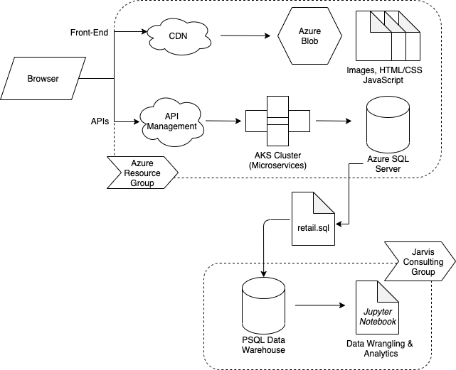

# Introduction
The online retailer, London Gift Shop, is struggling with the flattening revenues in recent years, and is looking for an effective marketing strategy based upon modern data engineering technologies to reboost their revenues. Since LGS lacks the necessary infrastructure and knowledge to perform the analytics, it contacted Jarvis data engineering team to provide the required service.

As an introductory Proof of Concept project for LGS to showcase Jarvis data engineering expertise, the Jarvis team was engaged in setting up an data warehouse separated from the LGS's database for OLAP purposes. The data warehouse uses a temporary PostgreSQL database to store retail order data, and the data wrangling and analytics are performed in a Jupyter Notebook file that utilizes the Python Pandas package.

# Project Architecture

### Architecture Diagram

### LGS Web Application Architecture

The London Gift Shop's retail web application utilizes a Microsoft Azure Resource Group to package both front-end and API components. In the front-end, the application features Azure Blob to allocate HTML, CSS, and JS documents, and an Azure CDN to deliver the contents to the browser. The back end component follows a microservices architecture in a AKS cluster and that the API itself is managed by Azure API Management, and on the database side, an Azure SQL Server is set up for day-to-day business OLTP. Within this PoC project, a sample dataset is extracted from the LGS database and denormalized and ingested into a separate PostgreSQL data warehouse, and is then connected to a Jupyter Notebook for Python analysis.

# Data Analytics and Wrangling

### Notebook Analysis Description

The PoC project notebook (found [here](retail_data_analytics_wrangling.ipynb)) performs data preparation and cleaning, and then presents analytics in the following topics with result tables and plots:
  1. Total distribution of amount for all invoices
  2. Monthly revenue and its growth trend
  3. Trends of number of active, new, and existing customer change
  4. An RFM table for all customers and a RFM segmentation result summary table

### Insights and Strategy

The segmentation result shows that the most potentially impactful customer segments are "Can't Lose", "Hibernating", and "Champions", and therefore an effective strategy should include a tailored action for each of the three.
  1. *Can't Lose*: these customer used to made a large number of purchases, but have not recently made a purchase. It seems necessary to conduct a separate investigation on the reason of them not buying. Also, offering discount coupons and delivering campaign focused on new item suggestions and recommendations based on previous purchase records may increase their recency values.
  2. *Hibernating*: these customers have not made a purchase for a long time, therefore offering discounts seem to be the most direct and potentially effective action to win them back.
  3. *Champions*: these customers contribute the largest portion of the revenue in the past, and therefore the key objective is to ensure their loyalty in the future. Besides delivering regular advertisements and item recommendations, designing an exclusive benefit set based on their user images may also improve their experience.

# Improvements

- Perform a more thorough analysis based on the RFM segmentation result to determine actions for each of the group.
- Include some statistical analyses on revenue and customer trends, such as simple linear regression or time series.
- Include some analyses that focus on LGS's products, such as determining the most purchased products, most returned products, etc.