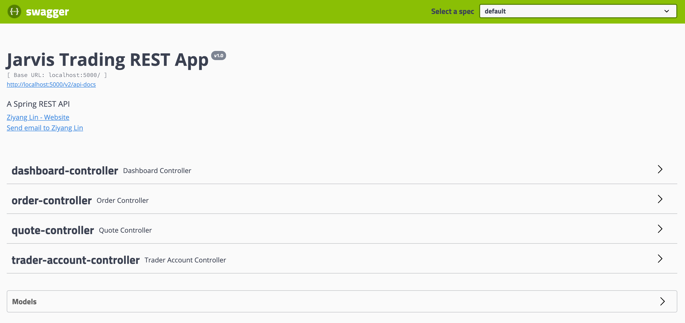

Table of contents
* [Introduction](#Introduction)
* [Quick Start](#Quick Start)
* [Architecture](#Architecture)
* [REST API Usage](#REST API Usage)
* [Docker Deployment](#Docker Deployment)
* [Improvements](#Improvements)

# Introduction

The Jarvis Trading Spring Boot REST API application is built upon a 3-tier microservice architecture along with DAO design pattern.
The application is able to create, manage, and delete trader accounts, 
display stock quotes, handle market orders stocks that are in the daily list. This REST API ideal for front-end and mobile developers to manage 
a series of portfolios and trader accounts, and can also be used by individual trader with REST API knowledge.

The application uses a Swagger UI to interact with users in the front-end, and all trading accounts are stored and handled by a PostgreSQL database as the backend component. All stock quotes data come from the IEX Cloud API.

#### Technologies Used
- *Design Patterns*: Model-View-Controller design pattern, Data Access Object design pattern, Microservices, Dependency Injection
- *Development Technologies*: REST API, serialization and deserialization with JSON, Spring Boot, Swagger UI
- *Testing*: JUnit 4, Mockito
- *Application Packaging*: Maven, Docker

# Quick Start
Prequiresites: Docker version 17.05 or higher

Starting application by setting up Docker network, images and containers

  - Step 1: Create a Docker network to connect the PostgreSQL container and the Spring Boot application container:
  
    `docker network create trading-net`
  - Step 2: Build Docker images for both PostgreSQL and the Spring Boot application
      
    ```
    # Building PostgreSQL Image
    cd ./springboot/psql
    docker build -t trading-psql .
      
    # Building Springboot Trading Application Image
    cd ./springboot
    docker build -t trading-app .
    ```
  - Step 3: First start a PostgreSQL container that connects to the created network
  
      ```
      docker run --name trading-psql-dev \
      -e POSTGRES_PASSWORD=password \
      -e POSTGRES_DB=jrvstrading \
      -e POSTGRES_USER=postgres \
      --network trading-net \
      -d -p 5432:5432 trading-psql
      ```
  - Step 4: Then set up `IEX_PUB_TOKEN` variable for IEX API access, and start a Spring Boot application container that connects to the created network
  
      ```
      # Set credential obtained from IEX
      IEX_PUB_TOKEN="IEX_token_from_your_IEX_console"
        
      # Start the container
      docker run --name trading-app-dev \
      -e "PSQL_URL=jdbc:postgresql://trading-psql-dev:5432/jrvstrading" \
      -e "PSQL_USER=postgres" \
      -e "PSQL_PASSWORD=password" \
      -e "IEX_PUB_TOKEN=${IEX_PUB_TOKEN}" \
      --network trading-net \
      -p 5000:8080 -t trading-app
      ```
   
  - Step 5: Consume the REST API following the instructions in the [REST API Usage](#REST API Usage) section.
  
  - Step 6: Stop the containers to exit the application.
    ```
    docker container stop jrvs-trading-app-ziyang
    docker container stop jrvs-trading-psql-ziyang
    ```
    
After starting both Docker containers, the REST API can be accessed via http://localhost:5000/swagger-ui.html.



# Architecture

### Architecture Diagram

The application is built on a 3-tier architecture that features a controller, a service, and a data access layer.
These 3 layers are implemented within a Spring boot parent project that supplies an Apache Tomcat WebServlet, and is connected
to a backend PostgreSQL database. Consider the architecture diagram below.


### The Three Layers
  - *Controller layer*: responsible for reading user inputs that come from the REST API endpoints in the form of HTTP requests, and then call the service layer to interpret and process those inputs.
  - *Service layer*: the layer that handles all business logic. Specifically, it validates user inputs parsed from the controller layer, and acquire resources from the database through the DAO layer.
  - *DAO layer*: interacting with resources in the backend database and IEX Cloud. It is responsible for all CRUD operations as requested from the service layer.
  
### Other Components:
  - *SpringBoot*: a Java REST API development framework and toolkit for dependency managements. It also supplies an Apache Tomcat WebServlet to handle API requests.
  - *PostgreSQL*: used as the backend RDBMS for this application that stores all quotes, traders, and accounts data in different tables, and is available for access through the DAO layer.
  - *IEX Cloud*: an open-source API that supplies all real-time stock quotes data used in this application. To access the API, a token is required.

# REST API Usage

### Swagger
Swagger is a UI tool for rendering an interactive API documentation and models as an HTML page.
Swagger is used in this project to provide readable and structured API usage instructions for users, and it is also convenient for testing for development purposes.


### Quote Controller
The Quote Controller corresponds to the `quote` table in the database. It contains endpoints to read, add, and update the table using resources at IEX Cloud.

Endpoint | Description
------------ | -------------
GET `/quote/dailyList` | Display all quotes in the current daily list of securities that are available for trading.
GET `/quote/iex/ticker/{ticker}` | Obtain and display the real-time quote information directly from IEX Cloud.
POST `/quote/tickerId/{tickerId}` | Store a security with the given `tickerId` into the daily list.
PUT `/quote/` | Store a `Quote` object supplied in the request body and store it into the daily list.
PUT `/quote/iexMarketData` | Update the quotes data in the daily list from IEX Cloud.
  
### Trader Account Controller

The Trader Account Controller corresponds to the `trader` and `account` tables in the database. It contains endpoints to add and delete traders and accounts, and also endpoints to update the account balance.
Note that for simplicity purpose, this application assumes one account per trader.

Endpoint | Description
------------ | -------------
PUT `/trader/deposit/traderId/{traderId}/amount/{amount}` | Deposit fund into the given trader's account.
PUT `/trader/withdraw/traderId/{traderId}/amount/{amount}` | Withdraw fund from the given trader's account.
POST `/trader/firstname/{firstname}/lastname/{lastname}/dob/{dob}/country/{country}/email/{email}` | Create and store a new trader with the given information in the request body into the database, and create an associated account automatically.
POST `/trader/` | Create and store the `Trader` object supplied in the request body into the database, and create an associated account automatically.
DELETE `/trader/traderId/{traderId}` | Delete the trader with ID `traderId` along with his/her account.

### Order Controller
The Order Controller corresponds to the `order` table and `position` view, and it has one endpoint to submit a market order (buy or sell) for a specific security.

Endpoint | Description
------------ | -------------
POST `/order/marketOrder` | Submit a market order according to the provided `MarketOrderDto` object and the associated trader's account balance and position. Note that positive size indicates a buy action, and a negative size indicates a sell action.

### Dashboard controller
The Dashboard Controller is used to obtain account profile and security portfolio view for a given trader via GET endpoints.

Endpoint | Description
------------ | -------------
GET `/dashboard/portfolio/traderId/{traderId}` | Display the security portfolio of the given trader that contains all currently holding positions.
GET `/dashboard/profile/traderId/{traderId}` | Display the profile of the given trader and his/her account.

# Docker Deployment

This application's Docker deployment consists of 2 images `trading-psql` and `trading-app`, see the below diagram.


- `trading-psql`: This image is built upon the `postgres` Docker image, and it is used to create a PSQL instance for the application. The DDL used to create tables is included in `psql/sql-ddl/schema.sql`, and will be automatically executed when the container is started.
- `trading-app`: This image is built upon the `openjdk:8-alpine` Docker image, which set up the running environment and the JDK for this application. Maven is also included in this image for packaging the Java application.

# Improvements

- Allow the `quote` table to be automatically updated via the IEX Cloud on a regular basis.
- Make the application support more order types such as limit orders, and more securities such as ETF, futures, bonds, etc.
- Simplify the endpoint for Order Controller such that the method takes path variables other than `MarketOrderDto` objects, which will make the application more user-friendly.
- Compact all Docker commands for starting the application into a bash script file so it can be more easily initiated.
- Allow multiple orders to be submitted via one request, and allow multiple accounts per trader.